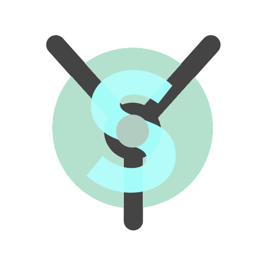

  

  <h1>Yemantic UI</h1>

  

    <strong>Yew Port of Semantic-UI-React</strong>
  

  <h4>
    <a href="https://lightsing.github.io/Yemantic-UI/yemantic_ui/index.html">Documentation (latest)</a>
  </h4>

## About

Yemantic UI is a port of [Semantic-UI-React](https://github.com/Semantic-Org/Semantic-UI-React)
to [Yew](https://github.com/yewstack/yew).

This project is currently in development and not ready for production.

## Contributing

We welcome all kinds of contributions, big or small,
from developers of all backgrounds.

#### 😱 Found a bug?

Please [report all bugs!](https://github.com/lightsing/Yemantic-UI/issues/new)
This is important for us.
